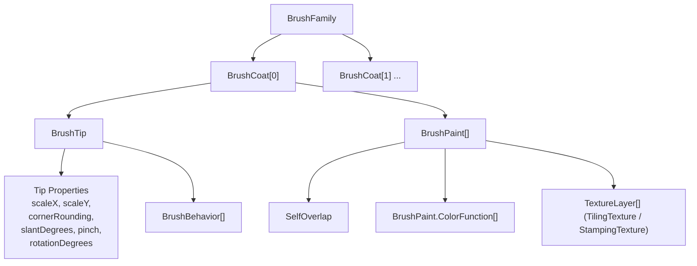

# Brush Family Hierarchy

## Overview

The Ink custom brush system is organized as a strict hierarchy:
**BrushFamily → BrushCoat → (BrushTip + BrushPaint)**. Understanding this hierarchy is essential for constructing and modifying custom brushes via data-class constructors.

## Hierarchy Diagram



## Hierarchy Roles

| Level | Type | Role |
|-------|------|------|
| **BrushFamily** | `BrushFamily` | Top-level container. Defines the brush "typeface" — all rendering coats. A single family is reused across strokes with different colors/sizes. |
| **BrushCoat** | `BrushCoat` | A single rendering pass/layer. Each coat has one `BrushTip` and either a single `paint: BrushPaint` or a prioritized fallback list `paintPreferences: List<BrushPaint>` (the renderer selects the *first* compatible `BrushPaint` in `paintPreferences`). Multiple `BrushCoat`s in `BrushFamily.coats` composite on top of each other in order (e.g., a shadow coat underneath a main stroke coat). |
| **BrushTip** | `BrushTip` | Defines the geometric shape of the mark at each point — size, aspect ratio, corner rounding, rotation. Also holds `BrushBehavior` graphs that dynamically modify the tip during rendering. |
| **BrushPaint** | `BrushPaint` | Defines visual appearance — self-overlap blending, color functions (`BrushPaint.ColorFunction`), and texture layers (`BrushPaint.TilingTexture` / `BrushPaint.StampingTexture`). |

## Creating a BrushFamily

### Full Construction with Coats

Construct a complete `BrushFamily` with one coat using Kotlin constructors:

```kotlin
import androidx.ink.brush.BrushFamily
import androidx.ink.brush.BrushCoat
import androidx.ink.brush.BrushTip
import androidx.ink.brush.BrushPaint
import androidx.ink.brush.SelfOverlap

val family = BrushFamily(
    coats = listOf(
        BrushCoat(
            tip = BrushTip(
                scaleX = 1f,
                scaleY = 1f,
                cornerRounding = 1f,
            ),
            paintPreferences = listOf(
                BrushPaint(
                    selfOverlap = SelfOverlap.ANY,
                    colorFunctions = listOf(
                        BrushPaint.ColorFunction.OpacityMultiplier(1f),
                    ),
                ),
            ),
        ),
    ),
)
```

> **Note:** `BrushCoat` also provides a single-paint convenience constructor: `BrushCoat(tip = BrushTip(...), paint = BrushPaint(...))`.

### Shortcut for Single-Coat Families

For simple brushes with a single coat, use the `tip` + `paint` shortcut on `BrushFamily`:

```kotlin
import androidx.ink.brush.BrushFamily
import androidx.ink.brush.BrushPaint
import androidx.ink.brush.BrushTip
import androidx.ink.brush.SelfOverlap

val familyShortcut = BrushFamily(
    tip = BrushTip(scaleX = 1f, scaleY = 1f, cornerRounding = 1f),
    paint = BrushPaint(selfOverlap = SelfOverlap.ANY),
)
```

> **Optional `BrushFamily` Parameters:** Both public constructors also accept optional `inputModel: BrushFamily.InputModel = BrushFamily.InputModel.DEFAULT_INPUT_MODEL` and `developerComment: String = ""` parameters (pass them as **named arguments**, e.g., `inputModel = BrushFamily.InputModel.DEFAULT_INPUT_MODEL, developerComment = "my-brush"`). In `1.1.0-alpha03+`, `BrushFamily.InputModel` publicly exposes `DEFAULT_INPUT_MODEL` (default `SlidingWindowModel()`), `PASSTHROUGH_MODEL` (minimal modeling for pre-modeled inputs), and `SlidingWindowModel(windowDurationMillis: Long, upsamplingFrequencyHz: Int)` (custom smoothing window in ms and upsampling rate in Hz, or `0` to disable upsampling). Note that `clientBrushFamilyId: String` remains annotated `@RestrictTo(RestrictTo.Scope.LIBRARY_GROUP)` across `1.0.0` and `1.1.0-alpha`.

## Creating a Brush Instance

Once you have a `BrushFamily`, create a `Brush` for use with Compose:

```kotlin
import androidx.ink.brush.Brush
import androidx.ink.brush.compose.createWithComposeColor
import androidx.compose.ui.graphics.Color

val brush = Brush.createWithComposeColor(
    family = family,
    color = Color.Black,
    size = 15f,
    epsilon = 0.1f,
)
```

## Modifying `BrushFamily` and `BrushCoat` (`copy`)

`BrushFamily` and `BrushCoat` are immutable, and both provide Kotlin `copy(...)` methods (as well as `toBuilder()` for Java callers) to derive modified variants without rebuilding from scratch (`BrushPaint` does not have a `copy(...)` method):

```kotlin
// Copy a BrushCoat with a modified tip or paintPreferences:
val baseCoat = family.coats.first()
val updatedCoat = baseCoat.copy(
    tip = baseCoat.tip.copy(cornerRounding = 0.5f),
)

// Copy a BrushFamily with updated coats, single coat, or tip + paint:
val updatedFamily = family.copy(
    coats = listOf(updatedCoat),
    developerComment = "rounded-variant",
)
```

## Common Pitfalls

- **Using `1.0.0` stable for programmatic custom brushes** — In `1.0.0` stable (and `1.1.0-alpha01`–`alpha02`), `BrushFamily(...)`, `BrushCoat`, `BrushTip`, `BrushPaint`, and `BrushBehavior` are `@RestrictTo(LIBRARY_GROUP)`. Programmatic custom brush creation requires `androidx.ink` **`1.1.0-alpha03+`**.
- **Zero coats** — A `BrushFamily` with no coats is invalid. At least one coat is required.
- **Confusing `BrushFamily.coats` with `BrushCoat.paintPreferences`** — Multiple `BrushCoat`s in `BrushFamily.coats` composite on top of each other as separate rendering layers. Multiple `BrushPaint`s in `BrushCoat.paintPreferences` are **prioritized fallback alternatives** — the renderer uses only the *first* `BrushPaint` in `paintPreferences` that is compatible with the device and renderer.
- **Coat ordering assumption** — Coats composite in list order. `coats[0]` renders first (bottom), `coats[1]` renders on top. This affects visual layering.
- **Using the wrong `SelfOverlap` value** — `SelfOverlap.ANY` (the default) uses mesh rendering on Android U+ (accumulating overlap) with automatic path fallback on older/software canvases; `SelfOverlap.ACCUMULATE` forces mesh overlap accumulation; `SelfOverlap.DISCARD` forces path rendering to suppress overlap within a stroke (e.g., highlighters) and is incompatible with `StampingTexture` and opacity/color `BrushBehavior`s on the same coat.
